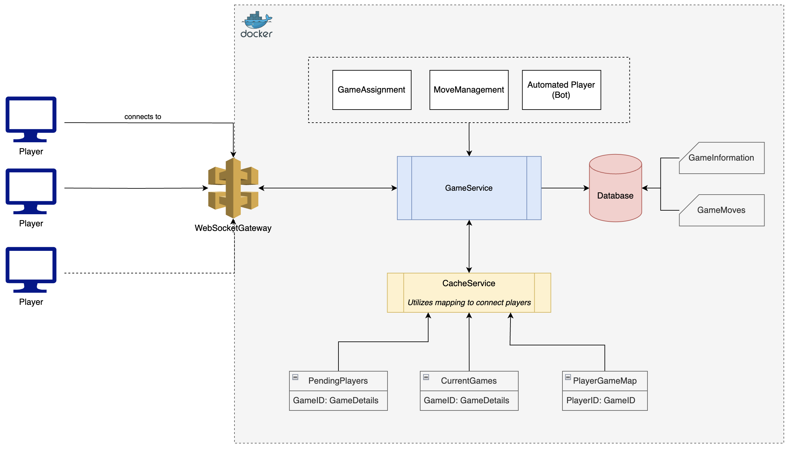
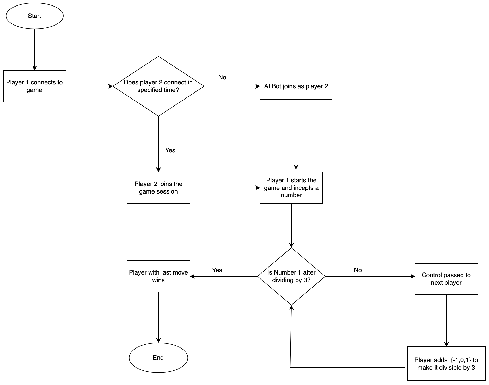

## JET - GameOfThree

### Description

Game of three is a multiplayer game that can be played by 2 clients in 1 session. 1st player starts by generating a random number and then the second player recieves this number and they have to apply of these 3 operations [-1,0,1] in order to make that number divisible by 3. Once they do they send back that resultant number which is generated doing division by 3.
They send the newly genrated number back and forth until one of the player hits 1 after division. That decides they have won the game.

### Architecture

I am using NestJS to build this game as a backend service by utilising Websockets. I have a server up and running which contains a websocket gateway to faciliate multiple number of users to connect to server simultaneously.


Then I have a main GameService which takes care of the game operations performed by either party in a single game session.
For high latency I am using a cache server to keep track of clients and their active sessions along with game and gameMoves information. I am using in-memory cache as a mock to using RedisCache Server.


I have also implemented a cold storage e.g. postgres database which keeps records as an async operation for further use e.g, reporting, dashboard, leaderboards etc.


There is an option to play the game with AI as well so once the first player connects, if it remains idle (doesn't get connected to other active players) for next 10 seconds, an AI bots joins the game and plays normally with user.
After every game is finished, players can continue to play again or disconnect.


A simple architecture representation can be seen as,



### Flow

Game flow can be represented as,




### Setup

To run this application locally, you can map this repository to your local and then run following command: 

```bash
$ docker compose up
```

This will initiate 2 images, first one will be the postgres database that can run as inside the container and the second will be the backend server which runs the socket hub along with game services. Server can be accessible at : 'http://localhost:3000/'

### Test

To run unit tests please run following command: 

```bash
$ npm run test
```